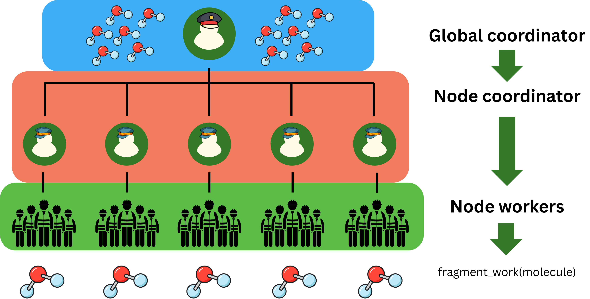

# Summary

Metalquicha is a Fortran library for massively parallel, fragmented quantum
chemistry calculations with emphasis in modularity, reusability, and ease
of adoption. It supports the Generalized Many Body Expansion (GMBE) with
and without overlapping fragments and can compute scalar and matrix-like
GMBE quantities, such as energies, gradients, and hessians using xtb
as a backend.


# Statement of need

Quantum chemistry methods are known for being computationally expensive and
impractical for realistic chemical systems, such as proteins, enzymes, and
materials [@gordon_fragmentation_2012]. Fragmentation methods offer a way to address the scalability problem
and additionally expose a naively parallel problem, i.e. all fragments
can be computed independently of each other.

The Fortran programming language has been extensively used in the quanutm
chemistry community, a number of legacy packages and new ones exist in the
literature [@zahariev_general_2023; @apra_nwchem_2020; @manathunga_quantum_2023; @bannwarth_extended_2021; @mironov_openqp_2024]. However, there is no modern Fortran package that leverages the
use of fragmenation techniques to access massively parallel architectures.

Additionally, fragmentation has been historically underexplored due to the
software complexity of implementing fragmentation routines in existing
packages. This is mostly because fragmentation needs to be implemented
at the very top level of a software package in order to fully leverage
the parallelism offered by it. Currently, only four packages in the literature
support fragmentation natively[@zahariev_general_2023; @galvez_vallejo_toward_2023; @takami_open-architecture_2007; @broderick_span_2025] - the rest, offer fragmentatin capabilities
through file based interfaces, which can be difficult to scale beyond a
couple processes.

Metalquicha, offers a Fortran based fragmentation framework that is able
to bind to external quanutm chemistry engines, provided a C like interface
is available to compute the core physical properties required. This aims to
simplify the adoption of fragmentation routines by allowing existing quantum
chemistry programs to write interfaces such as `calculate_quantity` where
quantity can be energy, gradient, hessian, etc. This allows existing
programs to access high level parallelism and work-load distribution
frameworks.

Metalquicha addresses the following community needs:

- Fortran based programs have been scared into adopting C++ for modernisation, Metalquicha aims to showcase that Fortran can still be used for massively parallel  quanutm chemistry applications
- A permissive licensed, reusable software that can be extended freely
- A modern modular fragmentation framework that can accommodate any type of quanutm chemistry method

Additionally, Metalquicha uses modern Fortran language features such as native
documentation through the Ford project and the use of the [Fortran package manager](https://fpm.fortran-lang.org/) (FPM)
in addition to CMake to be compiled and consumed.

# Software Description

## Scope

Metalquicha contains two high level routines: MBE and GMBE[@richard_generalized_2012] serial and MPI enabled
fragment workload distribution schemes that support non-covalently bound, and
covalently bound fragments using either overlapping fragments or hydrogen caps.

At the core of the fragment distribution scheme is the `node_worker` subroutine which
assigns a specific task to a process. In most cases, this is the calculation of
a property, such as the energy, gradient, or hessian matrix of a molecule. A
figure of the overall MPI distribution scheme is show here:



Currently, the `xtb` method is the only supported quantum chemistry "oracle". The
quantum chemistry engines are enabled via an abstract `calculation_method` object
that can be extended to support multiple types of methodologies. This allows
Metalquicha to be easily extended to replace `xtb` with a Restricted Hartree-Fock
(RHF) method, Density Functional Theory (DFT), among others.

The aim of Metalquicha is to incentivize development of quanutm chemistry methods
as a library-first API type design, providing high level interfaces to complex
methodologies. This will have two main effects: reusability of complex algorithms
and adaptability into frameworks, such as Metalquicha. A new calculator simply
needs to extend the `qc_method_t`:

```fortran
   type, abstract :: qc_method_t
      !! Abstract base type for all quantum chemistry methods
      !!
      !! Defines the required interface for energy and gradient calculations
      !! that must be implemented by all concrete method types (XTB, HF, etc.).
   contains
      procedure(calc_energy_interface), deferred :: calc_energy    !! Energy calculation interface
      procedure(calc_gradient_interface), deferred :: calc_gradient  !! Gradient calculation interface
      procedure(calc_hessian_interface), deferred :: calc_hessian  !! Hessian calculation interface
   end type qc_method_t
```

Metalquicha will support MPI or OpenMP driven methods, with the caveat as of the
current version of no multi node support per fragment evaluated, i.e. a single
fragment can at most use a single node for computation. Given that fragmentation
already partitions the system into feasible subsystems, I do not see this being
an impediment. However, capability for multi node fragments is planned as an
addition for the `1.0.0` release.

## Current capabilities

Provided enough work, Metalquicha will scale up to an arbitrary number of processors, since the (G)MBE is naively parallel.

The main bottleneck of the simulation should be obtaining the property of the chemical
system however, for cheap methods such as `xtb`, the final computation of the fragmented
energy can become a bottleneck if enough fragments are created.

## Documentation

The code is thoroughly documented using [FORD](https://forddocs.readthedocs.io/en/stable/)
for the [code documentation](https://jorgeg94.github.io/metalquicha/),  and the use of
Metalquicha is covered in a read-the-docs [hosted website](https://metalquicha.readthedocs.io/en/latest/).

## Testing

Automated unit tests and regression tests are run through Github Actions on every push,
ensuring the code is correct at every code modification.

## Input file format

In order to ensure portability, Metalquicha reads simple text files to process the chemical
input for a calculation. However, the front end uses a json format based on the QCSchema
and a python program to translate the json to the `mqc` format for Fortran consumption.

## Build system

As mentioned ealier, Metalquicha uses CMake and the FPM as coexisting build systems. The FPM
provides a powerful framework for including external dependencies, simply by ensuring they
have an `fpm.toml` file and them being included as:

```
[dependencies]
pic = { git = "https://github.com/JorgeG94/pic.git", branch = "main"}
pic-mpi = { git = "https://github.com/JorgeG94/pic-mpi.git", branch = "main"}
pic-blas = { git = "https://github.com/JorgeG94/pic-blas.git", branch = "main"}
tblite = { git = "https://github.com/JorgeG94/tblite", branch = "main"}
test-drive.git = "https://github.com/JorgeG94/test-drive"
openmp = "*"
```

In CMake this is achieved via `FetchContent_Declare` and `MakeAvailable`, allowing
for seamless access to other CMake projects. This allows Metalquicha to be easily extendable
and add external packages as dependencies.

## The PIC ecosystem

Metalquicha is driven by the `pic` ecosystem, which is a collection of three libraries
providing standard library like functions, BLAS/LAPACK, and MPI interfaces. [pic](https://github.com/JorgeG94/pic)
provides functionality such as `sort`, `logger`, `types`, I/O helpers, and timer functionality.

The [pic-blas](https://github.com/JorgeG94/pic-blas) library provides explicit interfaces to BLAS/LAPACK
functionality for portability and type safety, plus additional "helpers" which simplify the
calling of BLAS/LAPACK functions.

The [pic-mpi](https://github.com/JorgeG94/pic-mpi) library provides an abstraction layer to
the MPI implementation, either through the `mpi` or the `mpi_f08` modules with the exact
same API. This provides Metalquicha access to both mpi backends. The reason behind this
is that the `mpi_f08` module is not always instrumented for profilers and debuggers, leading
to "empty" MPI profiles. The default is the `mpi_f08` module.


# Acknowledgements

I would like to acknowledge the Fortran lang community for the development of projects
used in Metalquicha, such as the FPM, LFortran, and the inspiration found in the stdlib project.

I also would like to thank Ivan Pribec for listening to my programming debacles.

Finally, I'd like to thank my wife Dr. Elizabeth Gehrmann for enduring me developing this
code in my free time.

# References
